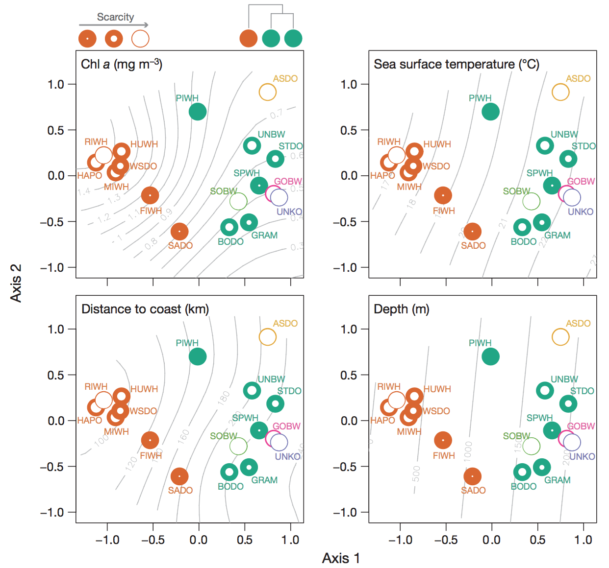

```{r setup, include=FALSE}
knitr::opts_chunk$set(echo = TRUE, eval=T)

suppressPackageStartupMessages({
  library(tidyverse)
  library(lubridate)
  library(raster)
  library(sp)
  library(leaflet)
  library(scales)
  library(vegan)
  library(rerddap)
  library(DT)
  library(readxl)
  library(stringr)
  #library(dygraphs)
  #library(xts)
})

select = dplyr::select
```

## Introduction

Already fetched RVC data from ERDDAP server in erddap_rvc.Rmd for 1999 - 2014.

_**Units**_: **density** # of individuals observed over 5 minute period within a 15 m diameter circle (and depth column)

## Gameplan

RVC:

Consider functional groups = Trophic_group, Exploited, Invasive (lionfish), Exploited (snapper grouper complex that's overfished; see Habitat_Indicator_Dataset_Metric_Hepner.xlsx|Importance:exploited, focal/charismatic)

1. Diversity index symbol - Effective Simpson, Effective Shannon, Richness (rarefy), Evenness
1. **Exploited** reef fish - abundance 
1. **Invasive** fish - abundance 
1. Herbivores: parrotfish - abundance 
1. Other fish groups?: 
  - cleaner fish: (gobis) but small
  - forage fish: (pigfish), more pelagic or in seagrass
  - ornamental: (damselfish, clown fish), different name?
  - missing?: red snapper
1. Herbivores: parrotfish - abundance 
1. Trophic level (>4 = apex predators?) - abundance

CREMP:

1. Stony coral - % cover, % disease, Simpson, Shannon 
1. Sponges - % cover 
1. Lobster - abundance
1. Queen conch - abundance 
1. Diadema - abundance 

Add-ons:

1. Functional Diversity: 
  - capture across larger group, or within functional groups
  - Rao's Q
1. Evaluate size classes over time, and in/out MPAs. Need to not aggregate across length classes.
1. Differentiate 4 subregions: 
  - upper/lower: more protected by land
  - middle keys: nutrient & freshwater influx from Bay
  - Dry Tortugas: more oceanic

Visualization:
- Treemap: box size by abundance / biomass, with hierarchical zooming

Scaling up to Abundance? Seperate from diversity.

1. Static: initially for FKNMS area for static products
1. Shiny: draw or select a region of interest and calculate abundance (ie total fish)

Normalizing. Using bray-curtis.

[Jerald Ault - Google Scholar Citations](https://scholar.google.com/citations?hl=en&user=cljlXUIAAAAJ&view_op=list_works&sortby=pubdate): fisheries modeler working on size classes inside/outside MPAs
- before/after Dry Tortugas

## Summarize Species Densities to Mapgrid Locations

- vignette: [Diversity analysis in vegan](https://cran.r-project.org/web/packages/vegan/vignettes/diversity-vegan.pdf)

- Lefcheck (2015) [The use of functional traits to elucidate
the causes and consequences of biological diversity](http://www.vims.edu/library/Theses/Lefcheck15.pdf)

- Lefcheck (2014) [Dimensions of biodiversity in Chesapeake Bay demersal fishes: patterns and drivers through space and time](http://onlinelibrary.wiley.com/doi/10.1890/ES13-00284.1/abstract) with supplemental [R script](https://figshare.com/articles/Supplement_1_R_script_containing_all_data_analyses_and_functional_phylogenetic_and_taxonomic_trees_in_Newick_format_/3563847)

- [Lab 8. Communities](http://benbestphd.com/landscape-ecology-labs/lab8.html) from [BB's Landscape Ecology Labs/](http://benbestphd.com/landscape-ecology-labs/) ([github](https://github.com/bbest/landscape-ecology-labs))

    - Schick et al (2011) [Community structure in pelagic marine mammals at large spatial scales](http://www.int-res.com/abstracts/meps/v434/p165-181/) _MEPS_
  
    
  

### Diversity indices

Copied from `vegan` vignette...

Function `diversity()` finds the most commonly used diversity
indices (Hill, 1973):

$$
H = - \sum_{i=1}^S p_i \log_b p_i  \tag{Shannon-Weaver}\\
$$

$$
D_1 = 1 - \sum_{i=1}^S p_i^2        \tag{Simpson}
$$

$$
D_2 = \frac{1}{\sum_{i=1}^S p_i^2}   \tag{inverse Simpson}
$$

where $p_i$ is the proportion of species $i$, and $S$ is the number of species so that $\sum_{i=1}^S p_i = 1$, and $b$ is the base of the logarithm.  It is most common to use natural logarithms (and then we mark index as $H'$), but $b=2$ has
theoretical justification. The default is to use natural logarithms. Shannon index is calculated with:

```{r vegan diversity}
data(BCI)
H <- diversity(BCI)
```

which finds diversity indices for all sites.

Package `vegan` does not have indices for evenness (equitability), but the most common of these, Pielou's evenness $J = H'/\log(S)$ is easily found as:

```{r vegan evenness}
J <- H/log(specnumber(BCI))
```

where `specnumber()` is a simple `vegan` function to find
the numbers of species.

Package `vegan` also can estimate series of Rényi and Tsallis
diversities. Rényi diversity of order $a$ is (Hill, 1973):

$$
H_a = \frac{1}{1-a} \log \sum_{i=1}^S p_i^a
$$

and the corresponding Hill number is $N_a = \exp(H_a)$.  Many common diversity indices are special cases of Hill numbers: $N_0 = S$, $N_1 = \exp(H')$, $N_2 = D_2$, and $N_\infty = 1/(\max p_i)$. The corresponding Rényi diversities are $H_0 = \log(S)$, $H_1 = H'$, $H_2 = - \log(\sum p_i^2)$, and $H_\infty = - \log(\max p_i)$.Tsallis diversity of order $q$ is (Tothmeresz, 1995):

$$
H_q = \frac{1}{q-1} \left(1 - \sum_{i=1}^S p^q \right)
$$

These correspond to common diversity indices: $H_0 = S-1$, $H_1 = H'$, and $H_2 = D_1$, and can be converted to Hill numbers:

$$
N_q = (1 - (q-1) H_q )^\frac{1}{1-q}
$$

## Data

* [Marine Biodiversity Observation Network](http://mbon.ioos.us/)
* [Marine Biodiversity Observation Network: Florida Keys Reef Fish Visual Census](http://mbon.ioos.us/#module-metadata/53cb8d58-ae4d-43e1-aea3-640db9491db2/9436fa4e-73aa-4189-b551-b3b484a9d4e9)
    
    > This fish survey timeseries contains count and length measurements for 340 species observed between 1995 and 2012 along the southern coast of Florida.
    >
    > Filter options:
    > - Alpha: takes the average of event values within the selected area
    > - Gamma: groups all events within the selected area and treats them as a single sample
    > - Beta: Gamma/Alpha
    > 
    > Richness: Count of distinct species
    > - % Dominance (Berger-Parker): Numerical importance of the most abundant species
    > - Shannon-Wiener Diversity: This index quantifies the uncertainty associated with species prediction
    > - Pielou's Evenness: Species evenness quantifies how close in count each species is within a sampling event

    - [ERDDAP - Information about 1994 Florida Keys Reef Visual Census, v3.3, from Marine Biodiversity Observation Network](http://gcoos4.tamu.edu:8080/erddap/info/fk1994/index.html)

* [Marine Biodiversity Observation Network: SECOORA Fisheries and Wildlife Monitoring - Fisheries-Independent Monitoring, Assessment, and Prediction (FIMMAP)](http://mbon.ioos.us/#module-metadata/07a25110-e19e-4ad4-b29c-a6978b68a90d/200d32d2-c827-451d-846e-f3413090dbfa)
* [Marine Biodiversity Observation Network: SECOORA Fisheries and Wildlife Monitoring - Marine Resources Monitoring, Assessment, and Prediction (MARMAP)](http://mbon.ioos.us/#module-metadata/07a25110-e19e-4ad4-b29c-a6978b68a90d/7b846aaa-db05-408d-bd77-ae4f12281480)


* [RVC | Data Portal](http://www.sefsc.noaa.gov/rvc_analysis20/?acton=index)
* [jeremiaheb/rvc: New implementation of the rvcstats package, which produces summary statistics for the South Florida Reef Visual Census](https://github.com/jeremiaheb/rvc)


## Time Series

Technical resources:

* [rerddap](https://github.com/ropensci/rerddap): R client for working with ERDDAP servers
* [dygraphs](http://rstudio.github.io/dygraphs/): interactive time series visualization
* [rmarkdown - HTML documents](http://rmarkdown.rstudio.com/html_document_format.html)

### Annotations

* [Annotations](http://rstudio.github.io/dygraphs/gallery-annotations.html) for Flower Garden Banks event

### Shiny Integration

* [Using in Shiny Applications](http://rstudio.github.io/dygraphs/shiny.html): eg `input$series_date_window` for dygraph called `series`


## Fetching Data

Combine ERDDAP datasets across years for Florida Keys Reef Visual Census

[ERDDAP: gcoos4.tamu.edu](http://gcoos4.tamu.edu:8080/erddap/info/index.html?page=1&itemsPerPage=1000)

```{r fetch}
# csv files to read (since time consuming to create using ERDDAP server calls)
rvc_rds     = 'data/rvc.rds'
rvc_mg_csv  = 'data/rvc_mapgrid_locations.csv'
rvc_spp_csv = 'data/rvc_species_densities.csv'

# assign ERDDAP server URL
eurl = 'http://gcoos4.tamu.edu:8080/erddap/' # search/index.html?page=1&itemsPerPage=1000&searchFor=Florida+Keys+Reef+Fish+Visual+Census

# only load full rvc.rds if need be (since slow)
if (!all(file.exists(c(rvc_mg_csv, rvc_spp_csv)))){
  if (!file.exists(rvc_rds)){
    # create csv files
    
    # search for datasets
    ed_search(query='Reef Visual Census', which='table', url=eurl)
    # TODO / NOTE: ed_search(page_size, page) DO NOT WORK! ACK!
    #ed_search(query='Reef Visual Census', which='table', url=eurl, page=2)
  
    # iterate over years
    all = list()
    
    ids = c(
      # Dry Tortugas
      sprintf('dt%d', c(1999,2000,2004,2006,2008,2010,2012,2014)),
      # Florida Keys
      sprintf('fk%d', 1999:2014)) # diff't method 1994:1998
    
    for (id in ids){ # id = ids[1]
    
      # construct id for dataset
      csv_id   = sprintf('data/%s.csv', id)
      csv_vars = sprintf('data/%s_vars.csv', id)
      cat(sprintf('%s\n', id))
      
      if (!file.exists(csv_vars)){
        # get metadata for dataset
        m = try(info(id, url=eurl), silent = T)
        
        if (class(m) == 'try-error') next
        cat(sprintf('  writing %s\n', csv_vars))
        write_csv(m$variables, csv_vars)
      }
      
      if (!file.exists(csv_id)){
      
        # get metadata for dataset
        m = try(info(id, url=eurl), silent = T)
        
        # if id not found, then move onto next year
        if (class(m) == 'try-error'){
          cat(sprintf('  %s NOT FOUND!\n', id)) # fk2013 NOT FOUND! b/c not there
          next
        } 
        
        # try fetching data, up to 10x
        dap_attempts = 1
        while (dap_attempts < 11){
          
          # load data for individual dataset
          cat('  fetching data', ifelse(dap_attempts > 1, sprintf(': attempt %d\n', dap_attempts), '\n'))
          d_id = try(tabledap(m, fields=m$variables$variable_name, url=eurl), silent = T)
          
          # break out of loop if not giving error
          if (!'try-error' %in% class(d_id)) break
          dap_attempts =+ 1
          cat('  error fetching data\n')
        }
      
        # write to csv
        cat('  writing to csv\n')
        d_id %>%
          tbl_df() %>%
          write_csv(csv_id)
        
      } # end if (!file.exists(csv_id))
    } # end for (yr in 1994:2014)
    
    # bind all csv's into one data frame
    cat("bind all csv's\n")
    d = data_frame()
    for (f in list.files('data','[fk|dt][0-9]+\\.csv', full.names=T)){
      cat(' ', f,'\n')
      d_f = read_csv(
        f, progress=F, trim_ws=T,
        col_types = cols(
          protection = col_character()))
      d = bind_rows(d, d_f)
    }
    
    write_rds(d, rvc_rds) # 4.4 GB
  
    # evaluate commonness of columns
    cat('eval common columns')
    vars = data_frame()
    for (f in list.files('data', '[fk|dt][0-9]+_vars\\.csv', full.names = T)){ # f = list.files('data', 'fk[0-9]+_vars\\.csv', full.names = T)[1]
      cat(f)
  
      vars = bind_rows(
        vars,
        read_csv(f) %>%
          mutate(
            id = str_replace(f, 'data/(.*)_vars\\.csv', '\\1')))
    }
    
    v = vars %>%
      select(variable_name, data_type, id) %>% # drop actual_range
      spread(id, data_type)
    
  
  } else {
    # read data
    d = read_rds(rvc_rds)
  }
  
  # show columns (with same class) not consistently available across all datasets
  summary(d)
  
  d %>%
    head() %>%
    datatable()
}
#View(fk$sample_data)
```

## Summarize by Mapgrid & Species

Fetched data had the following nested elements:

- count (`quantificationValue`) of species (`scientific_name`)
- species size classes (`observedMeanLengthInCm`)
- secondary station number (`station_nr`)
- primary sampling unit (`primarySamplingUnit`)
- map grid number (`mapGridNumber`)
- year of sampling event (`eventDate`)

Next, we aggregate to having average density of species per map grid.

```{r aggregate}
if ( !all(file.exists(c(rvc_mg_csv, rvc_spp_csv))) ){
  
  # read data fetched from erddap (erddap_rvc.Rmd)
  rvc = read_rds(rvc_rds)
    
  # summarize individual species counts to PSU
  rvc_psu = rvc %>%
    select(datasetID, eventDate, mapGridNumber, primarySamplingUnit, station_nr, 
           scientificName, quantificationValue) %>%
    filter(!is.na(station_nr)) %>%
    group_by(datasetID, eventDate, mapGridNumber, primarySamplingUnit, scientificName) %>%
    summarise(
      n_stations = length(unique(station_nr)),
      q = sum(quantificationValue, na.rm=T) / length(unique(station_nr))) %>%
    filter(q > 0, !is.na(q)) # filter: NA, 0's
  
  # mapgrid locations
  rvc_mg = rvc %>%
    group_by(datasetID, mapGridNumber) %>% # 200m x 200m
    summarise(
      latitude = mean(latitude, na.rm=T), 
      longitude = mean(longitude, na.rm=T))

  # summarize species to mapgrid locations
  rvc_spp = rvc_psu %>%
    left_join(rvc_mg, by=c('datasetID','mapGridNumber')) %>%
    mutate(
      year = year(eventDate)) %>%
    group_by(year, datasetID,  mapGridNumber, scientificName) %>%
    summarize(
      q_mean = mean(q)) %>%
    ungroup()
  
  # add sampling effort per datasetID (with year) and mapGridNumber by n_stations (secondary sampling units)
  rvc_spp = rvc_spp %>%
    left_join(
      rvc_psu %>%
        group_by(datasetID, eventDate, mapGridNumber, primarySamplingUnit, n_stations) %>%
        summarize(n_spp = n()) %>%
        group_by(datasetID, mapGridNumber) %>%
        summarize(
          n_stations = sum(n_stations)), 
      by = c('datasetID', 'mapGridNumber'))
      
  # # check n_stations (secondary) in primary in mapgrid
  # filter(rvc_spp, n_stations == 19) %>% distinct(mapgridnum) # 19 n_stations in 1999: 5787324, 8270424
  # rvc %>%
  #   filter(
  #     mapGridNumber == 5787324, 
  #     year(eventDate) == 1999) %>%
  #   group_by(primarySamplingUnit, station_nr) %>%
  #   summarize(
  #     n = n())
  
  # write to csv
  write_csv(rvc_mg, rvc_mg_csv)
  write_csv(rvc_spp, rvc_spp_csv)
}

# read in data
rvc_mg = read_csv(rvc_mg_csv)
rvc_spp = read_csv(rvc_spp_csv)
```

## Form Groups based on Traits

```{r traits to groups}
# read in species traits
spp_traits = read_csv('data/species_trait_matrix.csv') %>%
  mutate(
    Substrate_type = recode(
      Substrate_type, 
      'Hard bottoml' = 'Hard bottom',
      'Hardbottom' = 'Hard bottom'))

# remove white space on values and fix column names
spp_traits = apply(spp_traits, 2, function(x) str_trim(x)) %>%
  as_tibble()
names(spp_traits) = names(spp_traits) %>%
  str_trim() %>% str_replace(' ', '_') %>% tolower()
#View(spp_traits)

# read in species roles
spp_roles = read_excel(
  'data/Habitat_Indicator_Dataset_Metric_Hepner.xlsx',
  'Species Ecological Role') 

# remove white space on values and fix column names
spp_roles = apply(spp_roles, 2, function(x) str_trim(x)) %>%
  as_tibble()
names(spp_roles) = names(spp_roles) %>%
  str_trim() %>% str_replace(' ', '_') %>% tolower()
#View(spp_roles)
 
spp_roles = spp_roles %>%
  mutate(
    habitat  = zoo::na.locf(habitat), # fill down habitat
    importance = recode(
      importance, 
      'exploited, focal'       = 'exploited', 
      'exploited, charismatic' = 'exploited'),
    importance = ifelse(
      str_detect(indicator, '.*angelfish') & importance == 'ecologically important',
      'ornamental', importance)) %>%
  filter(!is.na(indicator))
#View(spp_roles)

# join to rvc_spp
rvc_spp = rvc_spp %>%
  select(
    year, dataset_id = datasetID, 
    mapgridnum = mapGridNumber, scientific_name = scientificName) %>%
  left_join(
    spp_traits,
    by = c('scientific_name'='latin_name')) %>%
  left_join(
    spp_roles,
    by = c('scientific_name'='scientific_name')) %>%
  mutate(
    group = ifelse(is.na(importance), trophic_group, importance))
# View(rvc_spp)

rvc_sum = rvc_spp %>%
  group_by(importance, trophic_group, group, scientific_name, common_name) %>%
  summarize(
    n = n())
write_csv(rvc_sum, 'data/rvc_spp_group-summary.csv')
rvc_sum %>%
  filter(is.na(group)) %>%
  write_csv('data/rvc_spp_no-group-removed.csv')

rvc_spp = rvc_spp %>%
  filter(!is.na(group))

write_csv(rvc_spp, 'data/rvc_spp_grouped.csv')
```  

```{r rvc_spp_group-summarized.csv}
read_csv('data/rvc_spp_group-summary.csv') %>%
  group_by(group) %>%
  summarize(
    n_species = n(),
    common_names = paste(common_name, collapse=', ')) %>%
  write_csv('data/rvc_spp_group-summarized.csv')
```


```{r crosstalk map of spp richness markers}
library(tidyverse)
library(leaflet)
library(scales)
library(DT)
library(crosstalk)

rvc_spp = read_csv('data/rvc_spp_grouped.csv')
rvc_mg  = read_csv('data/rvc_mapgrid_locations.csv')

spp_rich = rvc_spp %>%
  group_by(year,dataset_id, mapgridnum) %>%
  summarize(
    n_spp = length(unique(scientific_name))) %>%
  left_join(
    rvc_mg,
    by=c('dataset_id'='datasetID', 'mapgridnum'='mapGridNumber')) %>%
  rename(lat=latitude, lon=longitude)


# # Wrap data frame in SharedData
# sd <- SharedData$new(spp_rich[sample(nrow(spp_rich), 100),])
# 
# # Create a filter input
# filter_slider(
#   "year", "Year", sd, column=~year, step=1, width=with(sd$data(), max(year) - min(year)))
# 
# # Use SharedData like a dataframe with Crosstalk-enabled widgets
# bscols(
#   leaflet(sd) %>% 
#     addTiles() %>% 
#     addMarkers(lat=~lat, lng=~lon),
#   datatable(sd, extensions="Scroller", style="bootstrap", class="compact", width="100%",
#     options=list(deferRender=TRUE, scrollY=300, scroller=TRUE))
# )


# Wrap data frame in SharedData
#sd <- SharedData$new(spp_rich[sample(nrow(spp_rich), 100),])
sd <- SharedData$new(spp_rich[sample(nrow(spp_rich), 100),])
sd <- SharedData$new(spp_rich) # View(sd$data())

# Create a filter input
#filter_slider(
#   "year", "Year", sd, column=~date) # , width='90%', animate=T, timeFormat='%Y')
filter_slider(
  "year", "Year", sd, column=~year, width='90%', animate=T, sep='')
#, step=2, dragRange = 2)
  
  #sep='')
#with(sd$data(), max(year) - min(year))

# Create a palette that maps factor levels to colors
pal <- colorNumeric('YlOrRd', sd$data()$n_spp) # 'Spectral'

# Use SharedData like a dataframe with Crosstalk-enabled widgets
bscols(
  leaflet(sd) %>% 
    addProviderTiles('Esri.OceanBasemap') %>%
    addCircleMarkers(
      #lng = ~lon, lat = ~lat,
      radius = ~rescale(n_spp, to=c(0.1, 10)),
      color = ~pal(n_spp),
      stroke = FALSE, fillOpacity = 0.5) %>%
    addLegend("topleft", pal = pal, values = sd$data()$n_spp,
      title = "n spp", opacity = 1),
    #addMarkers(),
  datatable(sd, extensions="Scroller", style="bootstrap", class="compact", width="100%",
    options=list(deferRender=TRUE, scrollY=300, scroller=TRUE)))
```

```{r leaflet map of spp richness raster}
library(tidyverse)
library(leaflet)
library(raster)
library(sp)
library(rgdal)
library(scales)
library(DT)

rvc_spp = read_csv('data/rvc_spp_grouped.csv')
rvc_mg  = read_csv('data/rvc_mapgrid_locations.csv')

spp_rich = rvc_spp %>%
  group_by(year,dataset_id, mapgridnum) %>%
  summarize(
    n_spp = length(unique(scientific_name))) %>%
  left_join(
    rvc_mg,
    by=c('dataset_id'='datasetID', 'mapgridnum'='mapGridNumber')) %>%
  rename(lat=latitude, lon=longitude) %>%
  mutate(x = lon, y = lat) %>%
  ungroup()

# convert to points
pts_rich = spp_rich
coordinates(pts_rich) = ~ x + y
CRS(pts_rich) = leaflet:::epsg4326

pts_rich_mer <- spTransform(pts_rich, CRS(leaflet:::epsg3857))
summary(state.ll83)
state.merc <- spTransform(st
                          

rasterize(spp_rich) 
sp::

leafletCRS()

leaflet::addAwesomeMarkers()

# Get PROJ.4 information for a particular EPSG code
subset(EPSG, code==2784)

rasterize()

# Create a palette that maps factor levels to colors
pal <- colorNumeric('YlOrRd', sd$data()$n_spp) # 'Spectral'

# Use SharedData like a dataframe with Crosstalk-enabled widgets
bscols(
  leaflet(sd) %>% 
    addProviderTiles('Esri.OceanBasemap') %>%
    addCircleMarkers(
      #lng = ~lon, lat = ~lat,
      radius = ~rescale(n_spp, to=c(0.1, 10)),
      color = ~pal(n_spp),
      stroke = FALSE, fillOpacity = 0.5) %>%
    addLegend("topleft", pal = pal, values = sd$data()$n_spp,
      title = "n spp", opacity = 1),
    #addMarkers(),
  datatable(sd, extensions="Scroller", style="bootstrap", class="compact", width="100%",
    options=list(deferRender=TRUE, scrollY=300, scroller=TRUE)))
```


# Missing 
```{r missing, eval=F}
 
rvc_spp_missing = unique(rvc_spp$scientific_name)[!unique(rvc_spp$scientific_namee) %in% unique(spp_traits$latin_name)]
# 30 of 362 rvc_spp$scientific_name not in spp_traits$latin_name
# Myrichthys breviceps (n=1 in 2012)
# we can average numeric traits: Maxlength, Trophic_level, Gregariousness
#   vs categorical: Trophic_group	Water_column	Diel_activity	Substrate_type	Complexity

spp_traits_missing = unique(spp_traits$latin_name)[!unique(spp_traits$latin_name) %in% unique(rvc_spp$scientific_name)]
# eg missing red snapper (Lutjanus campechanus)
spp_traits %>%
  filter(latin_name %in% spp_traits_missing) %>%
  arrange(Trophic_group, Common_name) %>%
  View()

```

## Normalize

Do we normalize species density by site across species, species across sites, or a combination of both? Eg using max. Do the biodiversity metrics already do this? Eg, `vegdist()` applies `wisconsin()` normalization.

- Normalize within the species, or across the number of all individuals?
$$
n_s / max(n_s) \\
n_s / max(N_S) \\
$$

```{r wide}
rvc_spp = read_csv(rvc_spp_csv) %>%
  select(
    year, dataset_id = datasetID, 
    mapgridnum = mapGridNumber, scientific_name = scientificName, 
    q_mean, n_stations)

nstations_df = function(x){
  group_by(x, dataset_id, mapgridnum) %>% summarize(n_stations = first(n_stations))
}

#vegan prep
rvc_tbl = rvc_spp %>%
  nest(-year) %>%
  mutate(
    data_wide  = map(data, ~ spread(data=.x, scientific_name, q_mean, fill=0)))
```

```{r normalize, eval=F}
#feed site (rows) x species (columns)

vegdist_df <- function(df){
  vegdist(df %>% select(-dataset_id, -mapgridnum), 
      method="bray", binary=F, diag=F, upper=F)
}

rvc_tbl = rvc_tbl %>%
  mutate(
    veg_bray   = map(data_wide, vegdist_df),
    veg_bray_m = map(veg_bray, as.matrix))
#rvc_tbl$data_wide[[1]] (mapgridnum x species)
#spread(data=.x, scientific_name, q_mean, fill=0)
```

```{r sum, eval=F}
#summarize by species
rvc_spp_w = rvc_spp %>%
   group_by(scientific_name, year) %>%
   summarise(
     mg_q_var  = var(q_mean),
     mg_q_mean = mean(q_mean)) %>%
   ungroup()
```

## Biodiversity Metrics

- **Richness**
  - `specnumber`, 
  - `rarefy`: rarefied species richness for community ecologists. Normalizes by effort using rarefaction curves.
  
```{r examples rarefy specaccum}
# rarefy
data(BCI)
S <- specnumber(BCI) # observed number of species
(raremax <- min(rowSums(BCI)))
Srare <- rarefy(BCI, raremax)
plot(S, Srare, xlab = "Observed No. of Species", ylab = "Rarefied No. of Species")
abline(0, 1)
rarecurve(BCI, step = 20, sample = raremax, col = "blue", cex = 0.6)

# specaccum
data(BCI)
sp1 <- specaccum(BCI)
sp2 <- specaccum(BCI, "random")
sp2
summary(sp2)
plot(sp1, ci.type="poly", col="blue", lwd=2, ci.lty=0, ci.col="lightblue")
boxplot(sp2, col="yellow", add=TRUE, pch="+")
## Fit Lomolino model to the exact accumulation
mod1 <- fitspecaccum(sp1, "lomolino")
coef(mod1)
fitted(mod1)
plot(sp1)
## Add Lomolino model using argument 'add'
plot(mod1, add = TRUE, col=2, lwd=2)
## Fit Arrhenius models to all random accumulations
mods <- fitspecaccum(sp2, "arrh")
plot(mods, col="hotpink")
boxplot(sp2, col = "yellow", border = "blue", lty=1, cex=0.3, add= TRUE)
## Use nls() methods to the list of models
sapply(mods$models, AIC)
```

```{r Richness}  
#rarefraction curves are usful when comparing species richness with different sample sizes 
# x = abundance dataframe
# sample = number of sampling events 

rarefy_df = function(x){
  m = select(x, -dataset_id, -mapgridnum, -n_stations) %>% as.matrix()
  storage.mode(m) = 'integer'
  e = x %>% .$n_stations
  rarefy(m, e)}

rvc_tbl = rvc_tbl %>%
  mutate(
    specnumber = map(data_wide, function(x) select(x, -dataset_id, -mapgridnum, -n_stations) %>% specnumber),
    rarefy     = map(data_wide, rarefy_df))

# x = rvc_tbl$data_wide[[1]]
# x
# rarefy(x %>% select(-dataset_id, -mapgridnum), x$n_stations, se = F, Margin = 1)

# 
#     richness = map(veg_bray, rarefy(x, sample, se = F, Margin = 1))
# 
#     rvc_tbl$
#     
# dim(rvc_tbl$data_wide[[1]] %>% select(-dataset_id, -mapgridnum))
# v = specnumber(rvc_tbl$data_wide[[1]] %>% select(-dataset_id, -mapgridnum))
# length(v)
# 
# dim(BCI)
# data(BCI) # sites x species
# S <- specnumber(BCI) # observed number of species
# length(S)
# (raremax <- min(rowSums(BCI)))
# Srare <- rarefy(BCI, raremax)
#     
# rarefy(rvc_tbl$veg_bray_m, se = F, Margin = 1)
```  
 - **Evenness**: 
  - `Simpson` 1/D (1 = completely even)
```{r Effective Simpson}
  rvc_tbl = rvc_tbl %>%
  mutate(
    rvc_mg_eff_simpson  = map(1/(1-diversity(data_wide, function(x), select(x, -dataset_id, -mapgridnum), index='simpson')) %>% eff_simpson)

#rvc_mg_eff_simpson = 1/(1-diversity(rvc_mg_wide %>% select(-year, -datasetID, -mapGridNumber), index='simpson'))
``` 
  - `Shannon`, effective: rewards higher species linearly (vs just Shannon)
```{r Effective Shannon}
    rvc_mg_eff_shannon = exp(diversity(rvc_mg_wide %>% select(-year, -datasetID, -mapGridNumber), index='shannon'))
```

```{r Pielous Evenness}
#where x is abundance dataframe 
J <- diversity(x, index = 'shannon')/log(specnumber(x)) 
```
Spatial variants:
- **alpha**
- **gamma**
- **beta**

Others:
- **functional diversity**

```{r Effective Rao Q}
#read in species*community relative abundance dataframe 

#compute relative abundance of each species in each year and community
#remove 'sp.' in abundance dataframe - identified to family 
#substitute scientific name with species common name 

#arrange alphabetically 

#match species in trait dataframe with species in abundance dataframe 

#compute Gowers distance correcting with Podani for ordered traits 
traits.dist=gowdis(traits,ord="podani")

#Use clustering method to produce ultrametric dendrogramBecause values of Rao's Q can be maximized when fewer than the max number of functional types are present unless distances are ultramtetric 

#to account for sensitivity in clustering use multiple algorithms  (Mouchet et al., 2008) 
tree_methods = c("single","complete","average","mcquitty","ward")
trees=lapply(tree_methods,function(i) hclust(traits.dist,method=i))
par(mfrow=c(3,2))
for(i in 1:length(trees)) {plot(trees[[i]])}

#convert trees to ultrametric
trees.ultra=lapply(trees,function(i) cl_ultrametric(as.hclust(i)))

#Plot each tree
par(mfrow=c(3,2))
for (i in 1:length(trees.ultra)) {plot(trees.ultra[[i]])}

#Build the consensus tree (Mouchet et al 2008 Oikos) from package clue 
ensemble.trees=cl_ensemble(list=trees) #list of clusterings 
class(ensemble.trees)
consensus.tree=cl_consensus(ensemble.trees) #synthesizes the information in the elements of a cluster ensemble into a single clustering 
#plot(consensus.tree)

#Calculate dissimilarity values for each tree using 2-norm (Merigot et al 2010 Ecology) to determine which tree best preserves orignial distances
all.trees=c(trees.ultra,consensus.tree[1])
names(all.trees)=c(tree_methods,"consensus")
(trees.dissim=lapply(all.trees,function(i) cl_dissimilarity(i,traits.dist,method="spectral"))) #spectral norm (2-norm) of the differences of the ultrametrics

#Identify best tree and isolate
trees.dissim2=do.call(rbind,trees.dissim)
min.tree=which.min(trees.dissim2)
names(all.trees)[min.tree]
func.dist=all.trees[names(all.trees)==names(all.trees)[min.tree]][[1]]

#Confirm lowest 2-norm value
cl_dissimilarity(func.dist,traits.dist,method="spectral")

#Scale by the max value so that all values are between 0-1 (clue package)
func.dist=func.dist/max(func.dist)

#Plot the best tree
par(mfrow=c(1,1))
par(mar=c(3,1,0,16))
plot(func.dist,horiz=TRUE)
#Save plot: 10" x 15"

#Write newick tree
write.tree(as.phylo(as.hclust(func.dist)),"Functional dendrogram")

#calculate effective Rao's Q 
#Calculate alpha diversity
alphadiv.list=lapply(list(catch_abund,catch_biomass,catch_pres.abs),
 function(i) {
   #Extract community matrix from object in list
   mat=i[,c(1,18:(ncol(i)-1))]
   rownames(mat)=mat[,1]; mat=mat[,-1]
   #Calculate relative values for community matrix
   rel.mat=mat/apply(mat,1,sum)
   #Compute species diversity
   species.dist=matrix(1,ncol(mat),ncol(mat))-diag(rep(1,ncol(mat))) 
   species.div=1/(1-apply(rel.mat,1,function(x) t(x) %*% species.dist %*% x))
   #Compute evenness (as in Jost 2010 Diversity)
   evenness=log(species.div)/log(rowSums(mat>0))
   #Ensure that all evenness calculations are not >1 (bug)
   evenness[evenness>1]=1
   #Compute functional diversity 
   func.div=1/(1-apply(rel.mat,1,function(x) t(x) %*% as.matrix(func.dist) %*% x))
   #Compute phylogenetic diversity
   phylo.div=1/(1-apply(rel.mat,1,function(x) t(x) %*% as.matrix(phylo.dist) %*% x))
   #Compute taxonomic diversity
   taxo.div=1/(1-apply(rel.mat,1,function(x) t(x) %*% as.matrix(taxo.dist) %*% x))
   #Bind all to the original dataframe
   cbind(i,evenness,species.div,func.div,phylo.div,taxo.div) } ) 
names(alphadiv.list)=c("abund","biomass","pres.abs")

 
```
- **phylogenetic diversity**

## Correlation

```{r correlation}

#Test significance of Spearman rank correlations (H0 that rho = 0)
do.call(rbind,lapply(list("richness","evenness","simpson","shannon", "func.div"),function(j) {
  do.call(rbind,lapply(rev(list("richness","evenness","simpson","shannon","func.div")),function(k) {
    data.frame(title=paste(j,k,sep="~"),
               correlation=cor.test(alphadiv.list[[2]][,j],alphadiv.list[[2]][,k])$estimate,
               p.value=cor.test(alphadiv.list[[2]][,j],alphadiv.list[[2]][,k])$p.value) } ) ) } ) ) 

```

## Filter by MPA 

1. By protection (Inside and outside MPA) [protection]
    1. Sanctuary Preservation Areas (SPA)
        + Alligator Reef Sanctuary Preservation Area
        + Carysfort Sanctuary Preservation Area
        + Cheeca Rocks Sanctuary Preservation Area
        + Coffins Patch Sanctuary Preservation Area
        + Conch Reef Sanctuary Preservation Area
        + Davis Reef Sanctuary Preservation Area
        + Eastern Dry Rocks Sanctuary Preservation Area
        + The Elbow Sanctuary Preservation Area
        + French Reef Sanctuary Preservation Area
        + Grecian Rocks Sanctuary Preservation Area
        + Hen and Chickens Sanctuary Preservation Area
        + Key Largo Dry Rocks Sanctuary Preservation Area
        + Looe Key Sanctuary Preservation Area
        + Molasses Reef Sanctuary Preservation Area
        + Newfound Harbor Key Sanctuary Preservation Area
        + Sand Key Sanctuary Preservation Area
        + Rock Key Sanctuary Preservation Area
        + Sombrero Key Sanctuary Preservation Area
    1. Ecological Reserve (ER)
        + Tortugas Ecological Reserve
        + Western Sambo Ecological Reserve
    1. Special Use Areas (SU)
        + Conch Reef Research Only Area
        + Eastern Sambo Research Only Area
        + Looe Key Research Only Area
        + Tennesse Reef Research Only Area
        
## Filter by Subregion    

1.  By subregions [latitude,longitude]
    1. Upper Keys 
        + latitude  >24.95
    1. Middle Keys
        + latitude  >24.63 and <= 24.95
        + longitude >-81.10 and <= -80.45
    1. Lower Keys
        + latitude  >24.55 and <= 24.63
        + longitude >-82.65 and <=-81.10
    1. Dry Tortugas 
        + latitude  >24.55 and <= 24.75
        + longitude >-83.5 and <=-82.65
        
BB TODO:
- Translate [Lab 8. Communities](http://benbestphd.com/landscape-ecology-labs/lab8.html) for calculating Bray-Curtis dissimilarity, and applying NMDS & clustering with environmental gradients (gam contour plot). 

## Scaling up to Abundance

Can we use known habitat distributions (and possibly other environmental data) to predict abundance of a species for the same extent as known stock assessments?

Scaling up to **abundance**:

$$
d_s = n_s / a_s \\
a_s = \pi * 7.5 ^2 \\
n_A = d_s * A / a_s
$$

```
  esimp_d = rvc_mg_wide %>%
    select(year, datasetID, mapGridNumber) %>%
    mutate(
      eff_simpson = rvc_mg_eff_simpson) %>%
    left_join(
      rvc_mg_loc,
      by=c('datasetID','mapGridNumber'))
  
  esimp_pts = esimp_d
  coordinates(esimp_pts) = ~longitude+latitude
  
  # plot simpson for one year
  spplot(esimp_pts %>% subset(year==1999), zcol='eff_simpson')
  
  
  # interactive plot
  pal = colorNumeric('Spectral', esimp_pts@data$eff_simpson)
  
  esimp_pts %>%
    subset(year==2000) %>%
    leaflet() %>% 
      addProviderTiles('Esri.OceanBasemap') %>%
      addCircleMarkers(
        radius = 10,
        color = ~pal(eff_simpson),
        stroke = FALSE, fillOpacity = 0.5)
  
  
  # hex plot
  ggplot(esimp_d, aes(x=longitude, y=latitude, color=eff_simpson)) +
    geom_hex() + 
    scale_fill_distiller('Eff Simp', palette='Spectral')
  
  library(trelliscope)
  
  
  # columns ignored (for now):
  # basisOfRecord,bottomType,class,country,datasetID,datasetName,depth,dynamicProperties,eventDateRemarks,eventDateTimeZone,family,genus,geodeticDatum,habitat,habitat_cd,higherInstitutionCode,institutionCode,kingdom,latitude,locality,longitude,mapNumber,materialSampleID,maximumDepthInMeters,minimumDepthInMeters,observedMeanLengthInCm,order,ownerInstitutionCode,phylum,protection,quantificationMethod,quantificationName,quantificationStatus,quantificationUnit,,recordedBy,region,sampleRadiusInMeters,Samples,scientificNameAuthorship,scientificNameIDITIS,scientificNameIDWoRMS,species_cd,species_nr,specificEpithet,stateProvince,subregion_nr,taxonRank,time,timeUncertainty,underwaterVisibilityInMeters,vernacularName,verticalDatum,waterBody,waterTemperatureInCelsius,zone_nr
  
```

```{r analysis old, eval=F, echo=F}

d %>%
  mutate(
    year = year(eventDate)) %>%
  group_by(primarySamplingUnit, year) %>% # TODO: group_by(..., MPA)
  # confirm randomly stratified, so each primarySamplingUnit has one date
  # summarize(
  #   n_dates = length(unique(eventDate))) %>%
  # select(primarySamplingUnit, year, n_dates)
  select(primarySamplingUnit, year, station_nr, eventDate) %>%
  arrange(primarySamplingUnit, year, eventDate, station_nr) %>%
  View()
  summarize(
    
    # n_psu = length(unique(primarySamplingUnit))) %>%
    # select(year, n_psu) %>%
    # arrange(n_psu)

   n_station = length(unique(station_nr))) %>% #station_nr is station number? 
    select(year, n_station) %>%
    arrange(n_station)

#find if any unique psu has all zeros for 
  filter(quantificationValue > 0, !is.na(quantificationValue)) %>% # subset: 11,011 -> 1,529
  dim()

```

## Relating to the Environment

### Use Values in Dataset

Existing values:

- bottomType:
- mapNumber: in/out of MPA
- depth: bottom or in water column where observation?
  - minimumDepthInMeters
  - maximumDepthInMeters
- underwaterVisibilityInMeters: use that as a filter, and offset to account for bias
- waterTemperatureInCelsius
- habitat, habitat_cd: Artificial Reef, Continuous High/Medium/Low Relief, Isolated High/Medium/Low Relief (Patch)
- zone_nr: like Inshore, Foreef, Lagoon...

So we can evaluate the relationship between these predictors for basic understanding. But to predict elsewhere, we need these data for locations outside survey dataset.

### Extract and Predict with Outside Values

- BB asked Maria for seascapes data to extract and predict with this dataset (2017-01-19)

## Background

- **Ecological Reserves** larger and intention of protecting fisheries

- **SPA** (sanctuary preservation area) for dive spots, small

```{r functional diversity, eval=F} 

## readr::read_csv() # keeps strings as character, vs evil factors. yay! from readr
# utils::read.csv() # evil! base read of csv
sp_traits = traits %>%
  as_tibble() %>%
  select(-c(1:3)) %>%      # remove extra columns
  arrange(Common_name) %>% # arrange alphabetically by species
  filter(!Common_name == 'Na#') %>%
  mutate( 
    # factors are EVIL!
    Common_name = tolower(as.character(Common_name)),
    # change misclassified categorical traits to numeric 
    Maxlength     = as.numeric(as.character(Maxlength)),
    Trophic_level = as.numeric(as.character(Trophic_level)),
    # ordinal traits
    Complexity   = ordered(
      Complexity, levels=c("Low","Medium","High")),
      Gregariousness = ordered(Gregariousness, levels=c("1","2","3"))) %>%
  as.data.frame()

# conform to: species x traits
rownames(sp_traits) = sp_traits$Common_name
sp_traits = sp_traits %>% select(-Common_name)
head(sp_traits)

sp_sr_ra$data_wide[[1]]


#### OLD (Jan 18)
#Calculate Gower distances
traits.dist = gowdis(traits, ord="podani")

#Functional Diversity
sp_sr_ra %>%
  mutate(
    fd = map(data_wide, dbFD)
  )

# remove species rows in traits without abundances
sp_traits = sp_traits[rownames(sp_traits) %in% colnames(sp_sr_ra$data_wide[[1]]),]

traits_dist = gowdis(sp_traits, ord="podani")

dim(sp_traits)
dim(sp_sr_ra$data_wide[[1]])

#functional_div = dbFD(sp_traits, sp_sr_ra$data_wide[[1]])
#functional_div = dbFD(traits_dist, sp_sr_ra$data_wide[[1]])
# worked w/out factors...
functional_div = dbFD(
  sp_traits %>%
    select(Maxlength, Trophic_level), 
  sp_sr_ra$data_wide[[1]])

# didn't work: Species x species distance matrix was still is not Euclidean after 'sqrt' correction. Use another correction method.
# functional_div = dbFD(
#   sp_traits %>%
#     select(Maxlength, Trophic_level, Water_column), 
#   sp_sr_ra$data_wide[[1]])

# didn't work: Species x species distance matrix was still is not Euclidean after 'sqrt' correction. Use another correction method.
traits_dist = gowdis(
  sp_traits %>%
    select(Maxlength, Trophic_level, Water_column), ord="podani",)

functional_div = dbFD(traits_dist, sp_sr_ra$data_wide[[1]],corr = 'cailliez', calc.FRic= F, calc.FGR=F, calc.CWM=F )

```

## TODO

- Where's the Dry Tortugas data, eg for 2000?
- check out MPA

- fix [obis_biodiv.Rmd](https://marinebon.github.io/analysis/obis_biodiv.html) with proper names

## Notes for ERDDAP Correction

- `mapNumber` -> `mpaNumber`
- `Samples`: 361,351 records with Samples # and all other fields are NA or NaN?!
