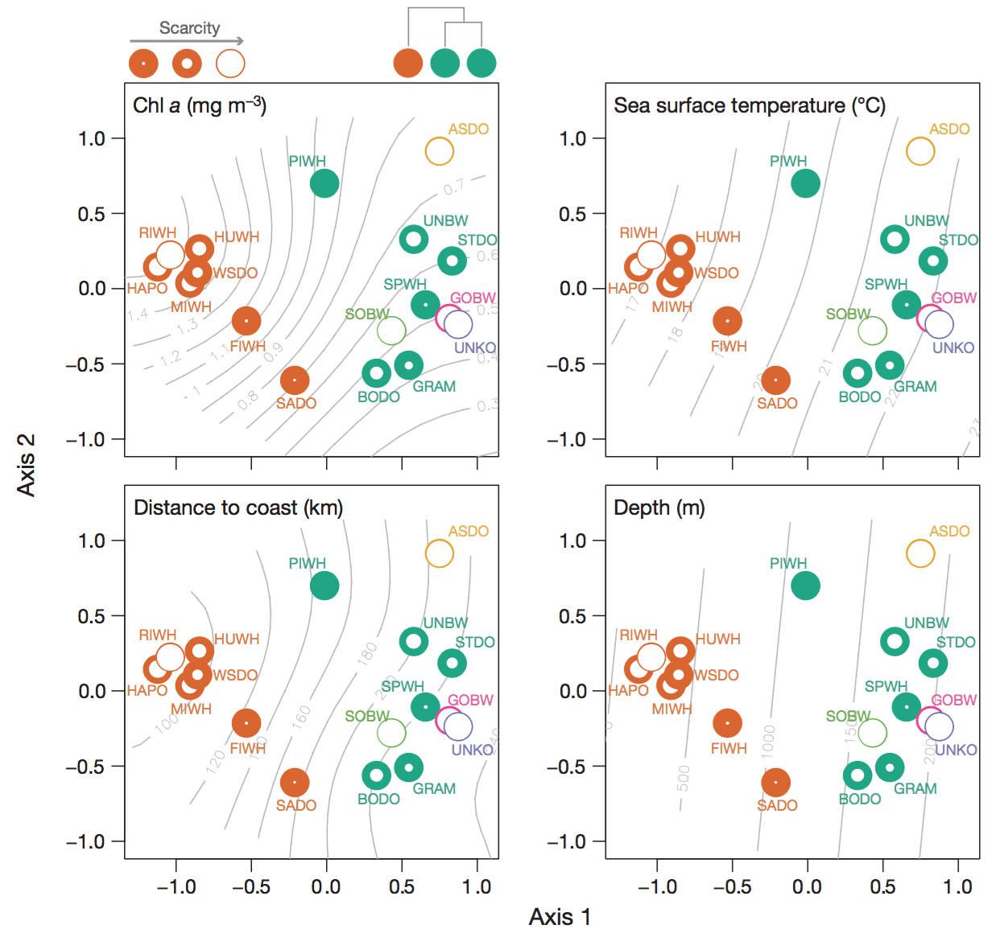

```{r setup, include=FALSE}
knitr::opts_chunk$set(echo = TRUE)
```

## Data

* [Marine Biodiversity Observation Network](http://mbon.ioos.us/)
* [Marine Biodiversity Observation Network: Florida Keys Reef Fish Visual Census](http://mbon.ioos.us/#module-metadata/53cb8d58-ae4d-43e1-aea3-640db9491db2/9436fa4e-73aa-4189-b551-b3b484a9d4e9)
    
    - [ERDDAP - Information about 1994 Florida Keys Reef Visual Census, v3.3, from Marine Biodiversity Observation Network](http://gcoos4.tamu.edu:8080/erddap/info/fk1994/index.html)

* [Marine Biodiversity Observation Network: SECOORA Fisheries and Wildlife Monitoring - Fisheries-Independent Monitoring, Assessment, and Prediction (FIMMAP)](http://mbon.ioos.us/#module-metadata/07a25110-e19e-4ad4-b29c-a6978b68a90d/200d32d2-c827-451d-846e-f3413090dbfa)
* [Marine Biodiversity Observation Network: SECOORA Fisheries and Wildlife Monitoring - Marine Resources Monitoring, Assessment, and Prediction (MARMAP)](http://mbon.ioos.us/#module-metadata/07a25110-e19e-4ad4-b29c-a6978b68a90d/7b846aaa-db05-408d-bd77-ae4f12281480)

* [RVC | Data Portal](http://www.sefsc.noaa.gov/rvc_analysis20/?acton=index)
* [jeremiaheb/rvc: New implementation of the rvcstats package, which produces summary statistics for the South Florida Reef Visual Census](https://github.com/jeremiaheb/rvc)

_**Units**_: **density** # of individuals observed over 5 minute period within a 15 m diameter circle (and depth column) 

##Background 

- RVC Data 
    > This fish survey timeseries contains count and length measurements for 340 species observed between 1995 and 2012 along the southern coast of Florida.
    >
    > Filter options:
    > - Alpha: takes the average of event values within the selected area
    > - Gamma: groups all events within the selected area and treats them as a single sample
    > - Beta: Gamma/Alpha
    > 
    > Richness: Count of distinct species
    > - % Dominance (Berger-Parker): Numerical importance of the most abundant species
    > - Shannon-Wiener Diversity: This index quantifies the uncertainty associated with species prediction
    > - Pielou's Evenness: Species evenness quantifies how close in count each species is within a sampling event
    
## Time Series

Technical resources:

* [rerddap](https://github.com/ropensci/rerddap): R client for working with ERDDAP servers
* [dygraphs](http://rstudio.github.io/dygraphs/): interactive time series visualization
* [rmarkdown - HTML documents](http://rmarkdown.rstudio.com/html_document_format.html)

### Annotations

* [Annotations](http://rstudio.github.io/dygraphs/gallery-annotations.html) for Flower Garden Banks event

### Shiny Integration

* [Using in Shiny Applications](http://rstudio.github.io/dygraphs/shiny.html): eg `input$series_date_window` for dygraph called `series`

## Gameplan

RVC:

Consider functional groups = Trophic_group, Exploited, Invasive (lionfish), Exploited (snapper grouper complex that's overfished; see Habitat_Indicator_Dataset_Metric_Hepner.xlsx|Importance:exploited, focal/charismatic)

1. Diversity index symbol - Effective Simpson, Effective Shannon, Richness (rarefy), Evenness
1. **Exploited** reef fish - abundance 
1. **Invasive** fish - abundance 
1. Herbivores: parrotfish - abundance 
1. Other fish groups?: 
  - cleaner fish: (gobis) but small
  - forage fish: (pigfish), more pelagic or in seagrass
  - ornamental: (damselfish, clown fish), different name?
  - missing?: red snapper
1. Herbivores: parrotfish - abundance 
1. Trophic level (>4 = apex predators?) - abundance

CREMP:

1. Stony coral - % cover, % disease, Simpson, Shannon 
1. Sponges - % cover 
1. Lobster - abundance
1. Queen conch - abundance 
1. Diadema - abundance 

Add-ons:

1. Functional Diversity: 
  - capture across larger group, or within functional groups
  - Rao's Q
1. Evaluate size classes over time, and in/out MPAs. Need to not aggregate across length classes.
1. Differentiate 4 subregions: 
  - upper/lower: more protected by land
  - middle keys: nutrient & freshwater influx from Bay
  - Dry Tortugas: more oceanic### Diversity indices

Visualization:
- Treemap: box size by abundance / biomass, with hierarchical zooming

Scaling up to Abundance? Seperate from diversity.

1. Static: initially for FKNMS area for static products
1. Shiny: draw or select a region of interest and calculate abundance (ie total fish)

[Jerald Ault - Google Scholar Citations](https://scholar.google.com/citations?hl=en&user=cljlXUIAAAAJ&view_op=list_works&sortby=pubdate): fisheries modeler working on size classes inside/outside MPAs
- before/after Dry Tortugas

## Summarize Species Densities to Mapgrid Locations

- vignette: [Diversity analysis in vegan](https://cran.r-project.org/web/packages/vegan/vignettes/diversity-vegan.pdf)

- Lefcheck (2015) [The use of functional traits to elucidate
the causes and consequences of biological diversity](http://www.vims.edu/library/Theses/Lefcheck15.pdf)

- Lefcheck (2014) [Dimensions of biodiversity in Chesapeake Bay demersal fishes: patterns and drivers through space and time](http://onlinelibrary.wiley.com/doi/10.1890/ES13-00284.1/abstract) with supplemental [R script](https://figshare.com/articles/Supplement_1_R_script_containing_all_data_analyses_and_functional_phylogenetic_and_taxonomic_trees_in_Newick_format_/3563847)

- [Lab 8. Communities](http://benbestphd.com/landscape-ecology-labs/lab8.html) from [BB's Landscape Ecology Labs/](http://benbestphd.com/landscape-ecology-labs/) ([github](https://github.com/bbest/landscape-ecology-labs))

    - Schick et al (2011) [Community structure in pelagic marine mammals at large spatial scales](http://www.int-res.com/abstracts/meps/v434/p165-181/) _MEPS_
  
    
    
    
Copied from `vegan` vignette...

Function `diversity()` finds the most commonly used diversity
indices (Hill, 1973):

 ### Use Values in Dataset

Existing RVC values:

- bottomType:
- mapNumber: in/out of MPA
- depth: bottom or in water column where observation?
  - minimumDepthInMeters
  - maximumDepthInMeters
- underwaterVisibilityInMeters: use that as a filter, and offset to account for bias
- waterTemperatureInCelsius
- habitat, habitat_cd: Artificial Reef, Continuous High/Medium/Low Relief, Isolated High/Medium/Low Relief (Patch)
- zone_nr: like Inshore, Foreef, Lagoon...

So we can evaluate the relationship between these predictors for basic understanding. But to predict elsewhere, we need these data for locations outside survey dataset.

$$
H = - \sum_{i=1}^S p_i \log_b p_i  \tag{Shannon-Weaver}\\
$$

$$
D_1 = 1 - \sum_{i=1}^S p_i^2        \tag{Simpson}
$$

$$
D_2 = \frac{1}{\sum_{i=1}^S p_i^2}   \tag{inverse Simpson}
$$

where $p_i$ is the proportion of species $i$, and $S$ is the number of species so that $\sum_{i=1}^S p_i = 1$, and $b$ is the base of the logarithm.  It is most common to use natural logarithms (and then we mark index as $H'$), but $b=2$ has
theoretical justification. The default is to use natural logarithms. Shannon index is calculated with:

```{r vegan diversity}
data(BCI)
H <- diversity(BCI)
```

which finds diversity indices for all sites.

Package `vegan` does not have indices for evenness (equitability), but the most common of these, Pielou's evenness $J = H'/\log(S)$ is easily found as:

```{r vegan evenness}
J <- H/log(specnumber(BCI))
```

where `specnumber()` is a simple `vegan` function to find
the numbers of species.

Package `vegan` also can estimate series of Rényi and Tsallis
diversities. Rényi diversity of order $a$ is (Hill, 1973):

$$
H_a = \frac{1}{1-a} \log \sum_{i=1}^S p_i^a
$$

and the corresponding Hill number is $N_a = \exp(H_a)$.  Many common diversity indices are special cases of Hill numbers: $N_0 = S$, $N_1 = \exp(H')$, $N_2 = D_2$, and $N_\infty = 1/(\max p_i)$. The corresponding Rényi diversities are $H_0 = \log(S)$, $H_1 = H'$, $H_2 = - \log(\sum p_i^2)$, and $H_\infty = - \log(\max p_i)$.Tsallis diversity of order $q$ is (Tothmeresz, 1995):

$$
H_q = \frac{1}{q-1} \left(1 - \sum_{i=1}^S p^q \right)
$$

These correspond to common diversity indices: $H_0 = S-1$, $H_1 = H'$, and $H_2 = D_1$, and can be converted to Hill numbers:

$$
N_q = (1 - (q-1) H_q )^\frac{1}{1-q}
$$
# Missing 
```{r missing, eval=F}
 
rvc_spp_missing = unique(rvc_spp$scientific_name)[!unique(rvc_spp$scientific_namee) %in% unique(spp_traits$latin_name)]
# 30 of 362 rvc_spp$scientific_name not in spp_traits$latin_name
# Myrichthys breviceps (n=1 in 2012)
# we can average numeric traits: Maxlength, Trophic_level, Gregariousness
#   vs categorical: Trophic_group	Water_column	Diel_activity	Substrate_type	Complexity

spp_traits_missing = unique(spp_traits$latin_name)[!unique(spp_traits$latin_name) %in% unique(rvc_spp$scientific_name)]
# eg missing red snapper (Lutjanus campechanus)
spp_traits %>%
  filter(latin_name %in% spp_traits_missing) %>%
  arrange(trophic_group, common_name) %>% 
  View()

```
Do we normalize species density by site across species, species across sites, or a combination of both? Eg using max. Do the biodiversity metrics already do this? Eg, `vegdist()` applies `wisconsin()` normalization.

- Normalize within the species, or across the number of all individuals?
$$
n_s / max(n_s) \\
n_s / max(N_S) \\
$$
```{r normalize, eval=F}
#feed site (rows) x species (columns)
# Abundance based similarity measures - Bray-Crutis, similiar to normalized Manhattan distances (using abosolute abundances) .... computes compositional similarity between sites 
d = tribble(
  ~site, ~x, ~y, ~z,
  'a'   , 1,	2,	3,
  'b'   , 1,	5,	7,
  'c'   , 0,	2,	3)
  
m = matrix(c(
  1,	2,	3,
  1,	5,	7,
  0,	2,	3),
  nrow=3, byrow=T,
  dimnames = list(
    sites   = c('a','b','c'),
    species = c('x','y','z')))
m

#relative abundances 
r = matrix(c(
  1,	2,	3,
  1,	5,	7,
  0,	2,	3),
  nrow=3, byrow=T,
  dimnames = list(
    sites   = c('a','b','c'),
    species = c('x','y','z')))
r


vegdist(r, method='bray', diag=T, upper=T, binary=F)

spp = dimnames(r)[['species']]
bray_ab = sum(abs(r['a', spp] - r['b',spp])) / 
  sum(r['a',spp] + r['b',spp])
bray_ab

d[jk] = (sum abs(x[ij]-x[ik]))/(sum (x[ij]+x[ik]))
binary: (A+B-2*J)/(A+B)

vegdist_df <- function(df){
  vegdist(df %>% select(-dataset_id, -mapgridnum), 
      method="bray", binary=F, diag=F, upper=F)
}

rvc_tbl = rvc_tbl %>%
  mutate(
    veg_bray   = map(data_wide, vegdist_df),
    veg_bray_m = map(veg_bray, as.matrix))
#rvc_tbl$data_wide[[1]] (mapgridnum x species)
#spread(data=.x, scientific_name, q_mean, fill=0)
```

```{r sum, eval=F}
#summarize by species
rvc_spp_w = rvc_spp %>%
   group_by(scientific_name, year) %>%
   summarise(
     mg_q_var  = var(q_mean),
     mg_q_mean = mean(q_mean)) %>%
   ungroup()
```

## Biodiversity Metrics

- **Richness**
  - `specnumber`, 
  - `rarefy`: rarefied species richness for community ecologists. Normalizes by effort using rarefaction curves.

```{r examples rarefy specaccum}
# rarefy
data(BCI)
S <- specnumber(BCI) # observed number of species
(raremax <- min(rowSums(BCI)))
Srare <- rarefy(BCI, raremax)
plot(S, Srare, xlab = "Observed No. of Species", ylab = "Rarefied No. of Species")
abline(0, 1)
rarecurve(BCI, step = 20, sample = raremax, col = "blue", cex = 0.6)

# specaccum
data(BCI)
sp1 <- specaccum(BCI)
sp2 <- specaccum(BCI, "random")
sp2
summary(sp2)
plot(sp1, ci.type="poly", col="blue", lwd=2, ci.lty=0, ci.col="lightblue")
boxplot(sp2, col="yellow", add=TRUE, pch="+")
## Fit Lomolino model to the exact accumulation
mod1 <- fitspecaccum(sp1, "lomolino")
coef(mod1)
fitted(mod1)
plot(sp1)
## Add Lomolino model using argument 'add'
plot(mod1, add = TRUE, col=2, lwd=2)
## Fit Arrhenius models to all random accumulations
mods <- fitspecaccum(sp2, "arrh")
plot(mods, col="hotpink")
boxplot(sp2, col = "yellow", border = "blue", lty=1, cex=0.3, add= TRUE)
## Use nls() methods to the list of models
sapply(mods$models, AIC)
```
## Species Accumulation
```{r Species Accumulation}
#specaccum finds species accumulation curves or the number of species for a certain number of sampled sites or individuals

rvc_tbl = rvc_tbl %>%
  mutate(
    sp_accum = map(data_wide, function(x) specaccum(x %>% select(-dataset_id, -mapgridnum, -n_stations), method = "exact", conditioned = "true")))

#View(rvc_tbl)

```
##Rarefy 
```{r Rarefy, eval = F}

# rarefy_df = function(x){
#   m = select(x, -dataset_id, -mapgridnum, -n_stations) %>% as.matrix()
#   storage.mode(m) = 'integer'
#   e = x %>% .$n_stations
#   rarefy(m, e)}
# 
# rvc_tbl = rvc_tbl %>%
#   mutate(
#     specnumber = map(data_wide, function(x) select(x, -dataset_id, -mapgridnum, -n_stations) %>% specnumber),
#     rarefy     = map(data_wide, rarefy_df))

# x = rvc_tbl$data_wide[[1]]
# x
# rarefy(x %>% select(-dataset_id, -mapgridnum), x$n_stations, se = F, Margin = 1)

# 
#     richness = map(veg_bray, rarefy(x, sample, se = F, Margin = 1))
# 
#     rvc_tbl$
#     
# dim(rvc_tbl$data_wide[[1]] %>% select(-dataset_id, -mapgridnum))
# v = specnumber(rvc_tbl$data_wide[[1]] %>% select(-dataset_id, -mapgridnum))
# length(v)
# 
# dim(BCI)
# data(BCI) # sites x species
# S <- specnumber(BCI) # observed number of species
# length(S)
# (raremax <- min(rowSums(BCI)))
# Srare <- rarefy(BCI, raremax)
#     
# rarefy(rvc_tbl$veg_bray_m, se = F, Margin = 1)

```  

Spatial variants:
- **alpha**
- **gamma**
- **beta**

```{r analysis old, eval=F, echo=F}

d %>%
  mutate(
    year = year(eventDate)) %>%
  group_by(primarySamplingUnit, year) %>% # TODO: group_by(..., MPA)
  # confirm randomly stratified, so each primarySamplingUnit has one date
  # summarize(
  #   n_dates = length(unique(eventDate))) %>%
  # select(primarySamplingUnit, year, n_dates)
  select(primarySamplingUnit, year, station_nr, eventDate) %>%
  arrange(primarySamplingUnit, year, eventDate, station_nr) %>%
  View()
  summarize(
    
    # n_psu = length(unique(primarySamplingUnit))) %>%
    # select(year, n_psu) %>%
    # arrange(n_psu)

   n_station = length(unique(station_nr))) %>% #station_nr is station number? 
    select(year, n_station) %>%
    arrange(n_station)

#find if any unique psu has all zeros for 
  filter(quantificationValue > 0, !is.na(quantificationValue)) %>% # subset: 11,011 -> 1,529
  dim()

```

## Background

- **Ecological Reserves** larger and intention of protecting fisheries

- **SPA** (sanctuary preservation area) for dive spots, small

```{r functional diversity, eval=F} 

## readr::read_csv() # keeps strings as character, vs evil factors. yay! from readr
# utils::read.csv() # evil! base read of csv
sp_traits = traits %>%
  as_tibble() %>%
  select(-c(1:3)) %>%      # remove extra columns
  arrange(Common_name) %>% # arrange alphabetically by species
  filter(!Common_name == 'Na#') %>%
  mutate( 
    # factors are EVIL!
    Common_name = tolower(as.character(Common_name)),
    # change misclassified categorical traits to numeric 
    Maxlength     = as.numeric(as.character(Maxlength)),
    Trophic_level = as.numeric(as.character(Trophic_level)),
    # ordinal traits
    Complexity   = ordered(
      Complexity, levels=c("Low","Medium","High")),
      Gregariousness = ordered(Gregariousness, levels=c("1","2","3"))) %>%
  as.data.frame()

# conform to: species x traits
rownames(sp_traits) = sp_traits$Common_name
sp_traits = sp_traits %>% select(-Common_name)
head(sp_traits)

sp_sr_ra$data_wide[[1]]


#### OLD (Jan 18)
#Calculate Gower distances
traits.dist = gowdis(traits, ord="podani")

#Functional Diversity
sp_sr_ra %>%
  mutate(
    fd = map(data_wide, dbFD)
  )

# remove species rows in traits without abundances
sp_traits = sp_traits[rownames(sp_traits) %in% colnames(sp_sr_ra$data_wide[[1]]),]

traits_dist = gowdis(sp_traits, ord="podani")

dim(sp_traits)
dim(sp_sr_ra$data_wide[[1]])

#functional_div = dbFD(sp_traits, sp_sr_ra$data_wide[[1]])
#functional_div = dbFD(traits_dist, sp_sr_ra$data_wide[[1]])
# worked w/out factors...
functional_div = dbFD(
  sp_traits %>%
    select(Maxlength, Trophic_level), 
  sp_sr_ra$data_wide[[1]])

# didn't work: Species x species distance matrix was still is not Euclidean after 'sqrt' correction. Use another correction method.
# functional_div = dbFD(
#   sp_traits %>%
#     select(Maxlength, Trophic_level, Water_column), 
#   sp_sr_ra$data_wide[[1]])

# didn't work: Species x species distance matrix was still is not Euclidean after 'sqrt' correction. Use another correction method.
traits_dist = gowdis(
  sp_traits %>%
    select(Maxlength, Trophic_level, Water_column), ord="podani",)

functional_div = dbFD(traits_dist, sp_sr_ra$data_wide[[1]],corr = 'cailliez', calc.FRic= F, calc.FGR=F, calc.CWM=F )

```
```
  esimp_d = rvc_mg_wide %>%
    select(year, datasetID, mapGridNumber) %>%
    mutate(
      eff_simpson = rvc_mg_eff_simpson) %>%
    left_join(
      rvc_mg_loc,
      by=c('datasetID','mapGridNumber'))
  
  esimp_pts = esimp_d
  coordinates(esimp_pts) = ~longitude+latitude
  
  # plot simpson for one year
  spplot(esimp_pts %>% subset(year==1999), zcol='eff_simpson')
  
  
  # interactive plot
  pal = colorNumeric('Spectral', esimp_pts@data$eff_simpson)
  
  esimp_pts %>%
    subset(year==2000) %>%
    leaflet() %>% 
      addProviderTiles('Esri.OceanBasemap') %>%
      addCircleMarkers(
        radius = 10,
        color = ~pal(eff_simpson),
        stroke = FALSE, fillOpacity = 0.5)
  
  
  # hex plot
  ggplot(esimp_d, aes(x=longitude, y=latitude, color=eff_simpson)) +
    geom_hex() + 
    scale_fill_distiller('Eff Simp', palette='Spectral')
  
  library(trelliscope)
```

## Scaling up to Abundance

Can we use known habitat distributions (and possibly other environmental data) to predict abundance of a species for the same extent as known stock assessments?

Scaling up to **abundance**:

$$
d_s = n_s / a_s \\
a_s = \pi * 7.5 ^2 \\
n_A = d_s * A / a_s
$$

```{r leaflet map of spp richness raster, eval=F}
library(tidyverse)
library(sp)
library(rgdal)
library(raster)
#library(sf)
library(leaflet)
library(scales)
library(DT)

rvc_spp = read_csv('data/rvc_spp_grouped.csv')
rvc_mg  = read_csv('data/rvc_mapgrid_locations.csv')

# TODO: add species groups
spp_mg = rvc_spp %>%
  group_by(group, year, dataset_id, mapgridnum) %>%
  summarize(
    n_spp = length(unique(scientific_name)),
    q_mean = mean(q_mean, na.rm=T)) %>%
  left_join(
    rvc_mg,
    by=c('dataset_id'='datasetID', 'mapgridnum'='mapGridNumber')) %>%
  rename(lat=latitude, lon=longitude) %>%
  mutate(x = lon, y = lat) %>%
  ungroup()

# set projections
prj_gcs = leaflet:::epsg4326 # gcs: geographic coordinate system (decimal degrees)
prj_mer = leaflet:::epsg3857 # mer: web Mercator (meters)

# convert to points
pts = spp_mg
coordinates(pts) = ~ x + y
proj4string(pts) = prj_gcs
p = spTransform(pts, CRS(prj_mer)) # %>% st_as_sf()

# TODO: offset c(0.5,0.5) to get all points?
h = spsample(p,  type="hexagonal", cellsize=10000, offset=c(0,0)) %>%
  HexPoints2SpatialPolygons() # %>% st_as_sf() # plot(h)

# TODO: use make_hexgrid from http://strimas.com/spatial/hexagonal-grids/
# make_hexgrid <- function(x, cell_diameter, cell_area, clip = FALSE) {
#   if (missing(cell_diameter)) {
#     if (missing(cell_area)) {
#       stop("Must provide cell_diameter or cell_area")
#     } else {
#       cell_diameter <- sqrt(2 * cell_area / sqrt(3))
#     }
#   }
#   ext <- as(extent(x) + cell_diameter, "SpatialPolygons")
#   projection(ext) <- projection(x)
#   # generate array of hexagon centers
#   g <- spsample(ext, type = "hexagonal", cellsize = cell_diameter, 
#                 offset = c(0.5, 0.5))
#   # convert center points to hexagons
#   g <- HexPoints2SpatialPolygons(g, dx = cell_diameter)
#   # clip to boundary of study area
#   if (clip) {
#     g <- gIntersection(g, x, byid = TRUE)
#   } else {
#     g <- g[x, ]
#   }
#   # clean up feature IDs
#   row.names(g) <- as.character(1:length(g))
#   return(g)
# }
# h = spsample(pts_rich_mer, cell_diameter = 10000, clip=T)

# TODO: use dggridR: Discrete Global Grids for R
# https://cran.r-project.org/web/packages/dggridR/vignettes/dggridR.html#binning-lat-long-points

p$hex_id = over(p, h)

h_d = p@data %>% # View()
  mutate(
    grp_yr = sprintf('%s_%s', group %>% tolower() %>% str_replace_all(' ','.'), year)) %>%
  group_by(grp_yr, hex_id) %>%
  summarize(
    #n_pts  = n(),
    #n_spp  = mean(n_spp, na.rm=T),
    q_mean = mean(q_mean, na.rm=T)) %>%
  filter(!is.na(hex_id)) %>% # TODO: get hex_id where NA, ie no hex for pts?
  #arrange(n_spp) %>%
  spread(grp_yr, q_mean) %>%
  as.data.frame()
#View(h_d)
row.names(h_d) = h_d$hex_id

h_p = SpatialPolygonsDataFrame(h[h_d$hex_id], h_d, match.ID=F)
proj4string(h_p) = prj_mer

spplot(h_p['algal.farmer_1999'])
# yay! works

h_gcs = spTransform(h_p, CRS(prj_gcs)) # %>% st_as_sf()

geojsonio::geojson_write(h_gcs, file='data/hex_grp_yr_q.geojson')

library(RColorBrewer)

var = 'algal_farmer_1999'
v = h_gcs[[var]]
pal = colorNumeric(rev(brewer.pal(11, 'Spectral')), v)
leaflet(h_gcs) %>%
  addProviderTiles('Esri.OceanBasemap') %>%
  addPolygons(
    stroke = FALSE, fillOpacity = 0.5, smoothFactor = 0.5,
    color = pal(v)) %>%
  addLegend('topleft', pal = pal, values = v, title = var)

# yay! works

# TODO: [mapedit - interactively edit spatial data in R](http://r-spatial.org/r/2017/01/30/mapedit_intro.html)


# rasterize ----
b = bbox(pts_rich_gcs)
r_g = raster(extent(pts_rich_mer), resolution=200, crs=CRS(prj_mer))

r_a = rasterize(pts_rich_mer, r_g, 'n_spp', fun=mean) 
plot(r_a)

# Create a palette that maps factor levels to colors
pal <- colorNumeric('YlOrRd', spp_mg$n_spp, na.color = "transparent") # 'Spectral'

# TODO: ggmap static output

# old: map of spp richness pts ----
leaflet(spp_mg) %>% 
  addProviderTiles('Esri.OceanBasemap') %>%
  addRasterImage(r_a, colors = pal, opacity = 0.8) %>%
  addCircleMarkers(
    lng = ~lon, lat = ~lat,
    #radius = ~rescale(n_spp, to=c(0.1, 5)),
    radius = 5,
    #stroke = T, color = 'black', weight=0.1,
    stroke = F,
    #fill = ~pal(n_spp), fillOpacity = 1) %>%
    fill = 'blue', fillOpacity = 0.5) %>%
  addLegend("topleft", pal = pal, values = spp_mg$n_spp,
    title = "n spp", opacity = 1)
```

```{r correlation}

#Create scatterplot matrix of different diversity measures against one another (9" x 9")

               
#Test significance of Spearman rank correlations (H0 that rho = 0)
do.call(rbind,lapply(list("richness","evenness","eff_simpson","eff_shannon", "func_div"),function(j) {
  do.call(rbind,lapply(rev(list("richness","evenness","eff_simpson","eff_shannon","func_div")),function(k) {
    data.frame(title=paste(j,k,sep="~"),
               correlation=cor.test()$estimate,
               p.value=cor.test()$p.value) } ) ) } ) ) 

#Examine correlations between matrices using Mantel's test
mantel.rtest()

```

## Species detectability 
[Buckland et al., 2011. Biodiversity monitoring: the relevance of detectability. Biological diversity: frontiers in measurement and assessment.] 
Some species are inherently more easily detected than others. 
The RVC data was designed to detect exploited reef fish and does not do as well at detecting cryptic species (e.g. lionfish, gobies, blennies)
If detectability is not estimated, then biodiversity will be biased. However ignoring detectability might not be a major problem if the bias is consistant across time and space 
$$ 
\hat{p_i} = \hat{N_i}/\sum_{i=1}^S N_i = estimatedproportion of species i in the regoin \\

N_i = n_i/\hat\pi_i = estimated number of indiviudals of species i in the region\\

n_i = number of individuals of species i detected in the region \\

\hat\pi_i = probability of detection of an individual of species i 
$$
```{r Account for species detectability}

```
Columns ignored in RVC (for now):

<div class = "col3">
 basisOfRecord
 bottomType
 class
 country
 datasetID
 datasetName
 depth
 dynamicProperties
 eventDateRemarks
 eventDateTimeZone
 family
 genus
 geodeticDatum
 habitat
 habitat_cd
 higherInstitutionCode
 institutionCode
 kingdom
 latitude
 locality
 longitude
 mapNumber
 materialSampleID
 maximumDepthInMeters
 minimumDepthInMeters
 observedMeanLengthInCm
 order
 ownerInstitutionCode
 phylum
 quantificationMethod
 quantificationName
 quantificationStatus
 quantificationUnit
 recordedBy
 region
 sampleRadiusInMeters
 Samples
 scientificNameAuthorship
 scientificNameIDITIS
 scientificNameIDWoRMS
 species_cd
 species_nr
 specificEpithet
 stateProvince
 subregion_nr
 taxonRank
 time
 timeUncertainty
 underwaterVisibilityInMeters
 vernacularName
 verticalDatum
 waterBody
 waterTemperatureInCelsius
 zone_nr
</div>